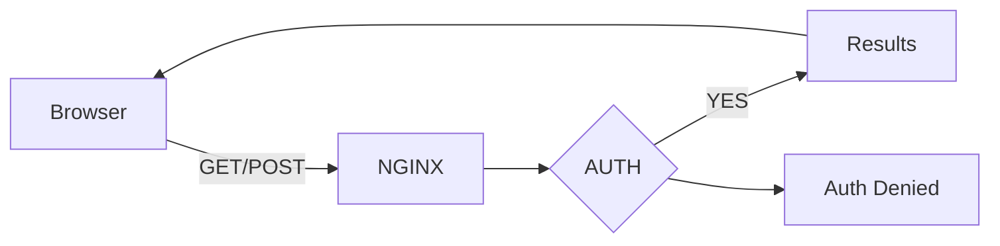

# Flask API with docker behind NGINX proxy for auth

```
A Docker Python-Flask with NGINX for the AUTH project
@maintainer G.Gatto 2021 - www.garanet.net
repo from: https://github.com/garanet/Docker-Python-Flask-with-NGINX-for-AUTH
Tested on a MacOsx with Docker + Kuberneters (Docker-Desktop)
```

This project shows how you can create a python flask api with docker behind a reverse proxy to protect different /endpoints. It could be easily integrated with different pipeline to trigger when a dockerfile or your app.py changes.
In the main folder you'll find a bash script to create or shutdown the containers. The script also is checking with a curl command if the containers are working or not.



**In order to run it, You need to have installed on your PC/MacOsX/Linux, Docker and docker-compose.**

## Files
|       FILE/FOLDER     |ASCII                          |ARGUMENTS                         |
|----------------|-------------------------------|-----------------------------|
|deploy_me.sh |`'To exec from your terminal with arguments'`            |'**start** = build&start containers'; '**stop** = stop containers;' '**remove** = stop&remove containers'            |
|docker-compose.yml|`"The directives for the 2 containers"`       |-            |
|/garanet/|`Include Dockerfile, Flask Application`|-|
|/nginx/   |`Include Dockerfile, Nginx conf, htpasswd`|-|

## Run it
You have to run it form your terminal, make sure the script has the exec privileges, otherwise run

    ~:# chmod a+x deploy_me.sh

    ~:#./deploy_me.sh start
Running tha above command, the Docker will create 2 docker containers locally to expose 3 endpoints API with FLASK.

 - The first container is the python FLASK app. 
 - The second container is the NGINX to proxy with a basic auth method the internal Flask API.

## How check it

From your browser you can retreive the urls:
**GET:**
http://localhost:8080/garanet
http://localhost:8080/world
**POST:**
From your terminal you can POST a JSON via curl like:

    ~:# curl --user guest --header "Content-Type: application/json" --request POST --data '{"key":"POST JSON WORKS"}' http://localhost:5000/getmyfile
The default username and password are ***guest / guest.***
You can change it generating a htapasswd file from the command line like:

    ~:# htpasswd -c PATH/.htapasswd username

## Shutdown the containers
    ~:#./deploy_me.sh stop
## Delete a file
    ~:#./deploy_me.sh remove
  